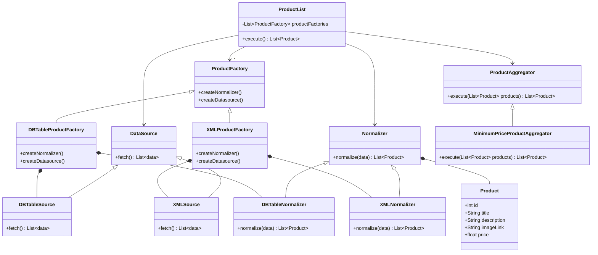
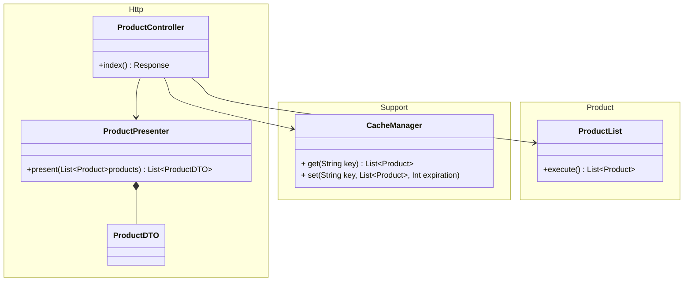
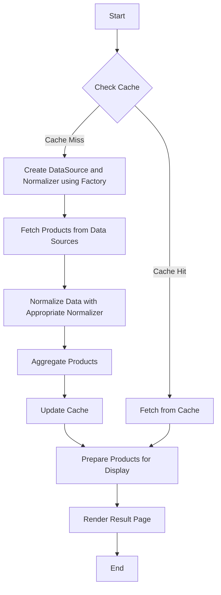

# Diagrams

## Class Diagrams
### Product Module

```mermaid
classDiagram
    class Product {
        +int id
        +String title
        +String description
        +String imageLink
        +float price
    }

    class DataSource {
        +fetch() List~data~
    }

    DataSource <|-- DBTableSource
    DataSource <|-- XMLSource

    class DBTableSource {
        +fetch() List~data~
    }

    class XMLSource {
        +fetch() List~data~
    }

    class Normalizer {
        +normalize(data) List~Product~
    }

    Normalizer <|-- DBTableNormalizer
    Normalizer <|-- XMLNormalizer

    class DBTableNormalizer {
        +normalize(data) List~Product~
    }

    class XMLNormalizer {
        +normalize(data) List~Product~
    }

    class ProductFactory {
        +createNormalizer()
        +createDatasource()
    }

    ProductFactory <|-- DBTableProductFactory
    ProductFactory <|-- XMLProductFactory

    class DBTableProductFactory {
        +createNormalizer()
        +createDatasource()
    }
    class XMLProductFactory {
        +createNormalizer()
        +createDatasource()
    }
    
    class ProductAggregator {
        +execute(List~Product~ products) List~Product~
    }
    
    class MinimumPriceProductAggregator {
        +execute(List~Product~ products) List~Product~
    }
    
    ProductAggregator <|-- MinimumPriceProductAggregator

    class ProductList {
        +execute() List~Product~
        -List~ProductFactory~ productFactories
    }

    Normalizer *-- Product
    DBTableProductFactory *-- DBTableSource
    DBTableProductFactory *-- DBTableNormalizer
    XMLProductFactory *-- XMLSource
    XMLProductFactory *-- XMLNormalizer
    ProductList --> "*" ProductFactory
    ProductList --> DataSource
    ProductList --> Normalizer
    ProductList --> ProductAggregator
```

### Controller

```mermaid
classDiagram
    namespace Http {
        class ProductDTO

        class ProductPresenter {
            +present(List~Product~products) List~ProductDTO~
        }
        
        class ProductController {
            +index() Response
        }
    }

    namespace Support {
        class CacheManager {
            + get(String key) List~Product~
            + set(String key, List~Product~, Int expiration)
        }
    }
    
    namespace Product {
        class ProductList {
            +execute() List~Product~
        }
    }
    
    ProductPresenter *-- ProductDTO
    ProductController --> ProductPresenter
    ProductController --> CacheManager
    ProductController --> ProductList
```

## Flowchart

```mermaid

flowchart TD
    A[Start] --> B{Check Cache}
    B -->|Cache Hit| C[Fetch from Cache]
    B -->|Cache Miss| D[Create DataSource and Normalizer using Factory]
    D --> E[Fetch Products from Data Sources]
    E --> F[Normalize Data with Appropriate Normalizer]
    F --> G[Aggregate Products]
    G --> H[Update Cache]
    H --> I[Prepare Products for Display]
    C --> I
    I --> J[Render Result Page]
    J --> K[End]
```
